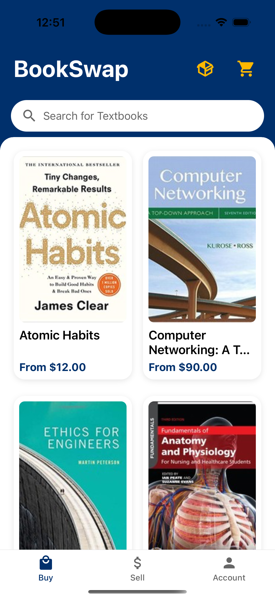
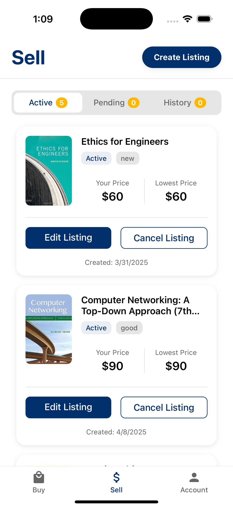

# BookSwap 📚

BookSwap is a book marketplace app designed specifically for UCSB students to buy and sell books. Built with React Native (Expo) for the frontend and Firebase (Auth, Firestore, Storage) for the backend.

## Screenshots

| Buy | Listing Page | Sell |
|-----|-----|-----|
|  |  |  |


## Setup

1. Clone the repo
   ```bash
   git clone https://github.com/your-username/bookswap.git
   cd bookswap
   ```

2. Install dependencies

   ```bash
   npm install
   ```

3. Set up Firebase
   
   - Create a new Firebase project at [Firebase Console](https://console.firebase.google.com/u/0/)
   - Enable Firestore, Firebase Auth, and Storage
   - Copy your Firebase config into firebaseConfig.ts

5. Start the app

   ```bash
    npx expo start
   ```

In the output, you'll find options to open the app in a

- [development build](https://docs.expo.dev/develop/development-builds/introduction/)
- [Android emulator](https://docs.expo.dev/workflow/android-studio-emulator/)
- [iOS simulator](https://docs.expo.dev/workflow/ios-simulator/)
- [Expo Go](https://expo.dev/go), a limited sandbox for trying out app development with Expo

## Major To-do

1. Stripe implementation
2. Redo admin page
    - check book drop offs, book pickups

## Minor To-do

1. Pricing details when listing
2. Do not allow users to buy books they have a listing for
3. Come up with process of holding/returning books
    - account strikes for when users fail to deliver/pickup
4. Fix page animation after log in/out
5. Fix selling instructions
6. Redo account submenus
7. Unify styling 
8. going back from book listing after coming from sell page takes you to buy page
9. Remove books with no listings (if necessary)
10. Limit pending + active listings to 10 (if necessary)
